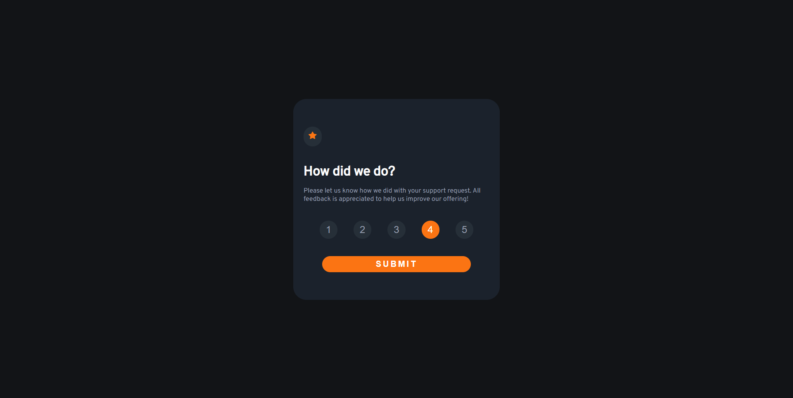

# Frontend Mentor - Interactive rating component solution

This is a solution to the [Interactive rating component challenge on Frontend Mentor](https://www.frontendmentor.io/challenges/interactive-rating-component-koxpeBUmI). Frontend Mentor challenges help you improve your coding skills by building realistic projects. 

## Table of contents

- [Overview](#overview)
  - [The challenge](#the-challenge)
  - [Screenshot](#screenshot)
  - [Links](#links)
- [My process](#my-process)
  - [Built with](#built-with)
  - [What I learned](#what-i-learned)
  - [Continued development](#continued-development)
  - [Useful resources](#useful-resources)

## Overview

### The challenge

Users should be able to:

- View the optimal layout for the app depending on their device's screen size
- See hover states for all interactive elements on the page
- Select and submit a number rating
- See the "Thank you" card state after submitting a rating

### Screenshot

### Links

- Solution URL: [Github Repository](https://github.com/Vulp0/rating-component-project)
- Live Site URL: [Github Pages site](https://vulp0.github.io/rating-component-project/)

## My process

### Built with

- **React** (create-react-app)
- Layout prototyped and copied with **Figma**

### What I learned

I've learnt that i'm not that incompetent, that i can actually finish projects lol.

But seriously, i find it easier to work on projects when i get to figure out the design first in Figma and *then* start working on actually building the site, instead of building and doing both at the same time. 

### Continued development

I want to focus more ona couple of things:
- Working on and finishing projects quicker
- Putting out more projects in general - getting more mileage would really help my confidence
- Need to get a better eye for design - i want my sites to be more visually appealing and better designed

### Useful resources

- [Youtube React tutorial playlist](https://www.youtube.com/watch?v=j942wKiXFu8&list=PL4cUxeGkcC9gZD-Tvwfod2gaISzfRiP9d) - This is where it all started
- [The React Docs](https://react.dev/) - For more specifics info on how to use React
- [MDN Web docs](https://developer.mozilla.org/en-US/) - For when i had doubts about anything HTML, CSS or JS

